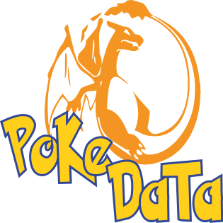
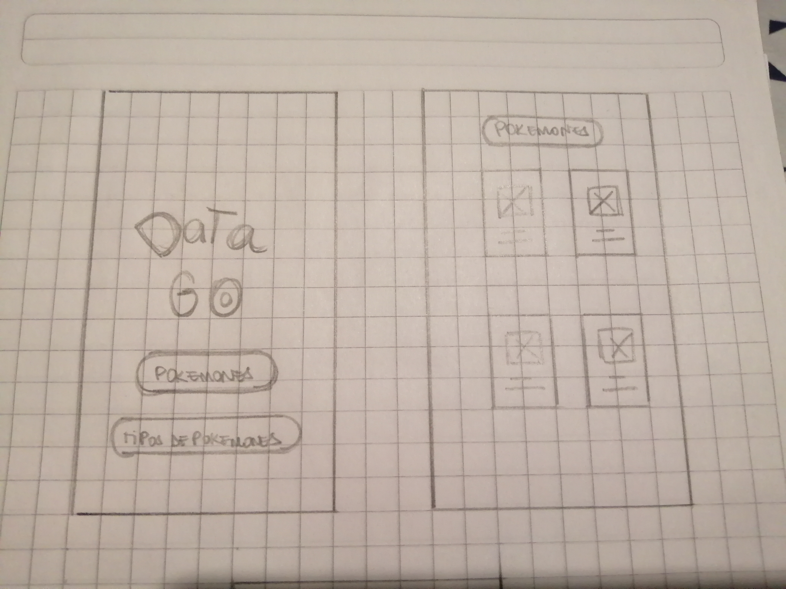
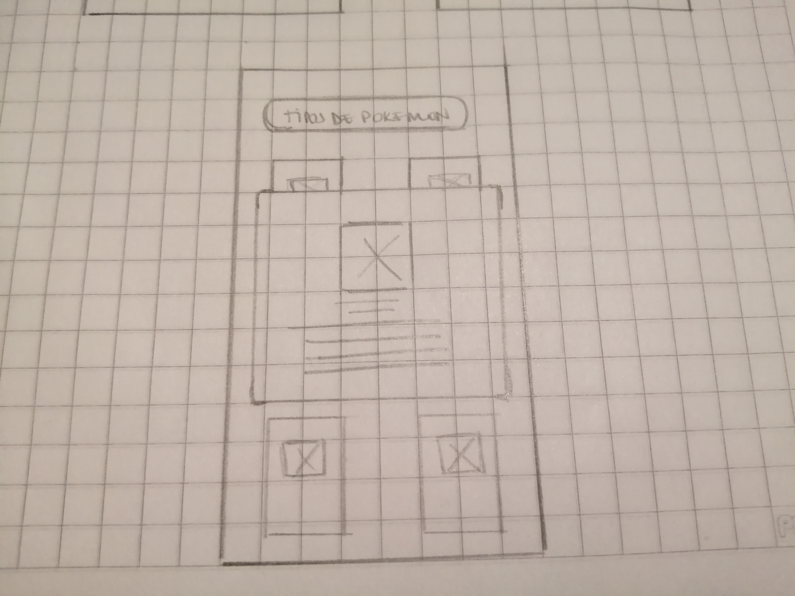
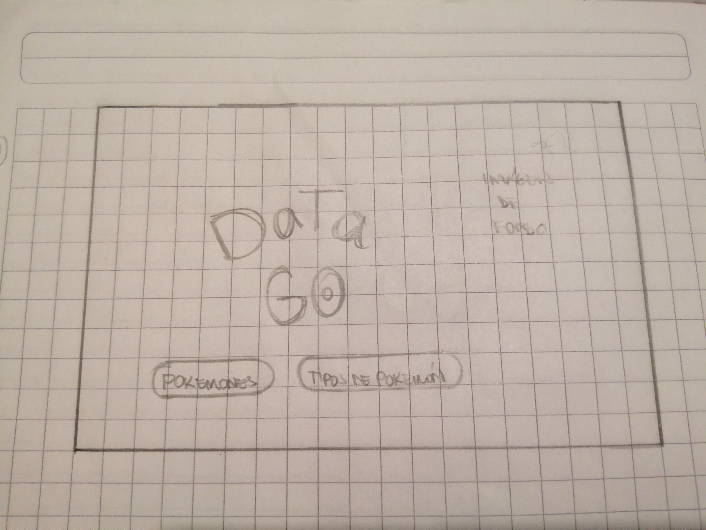
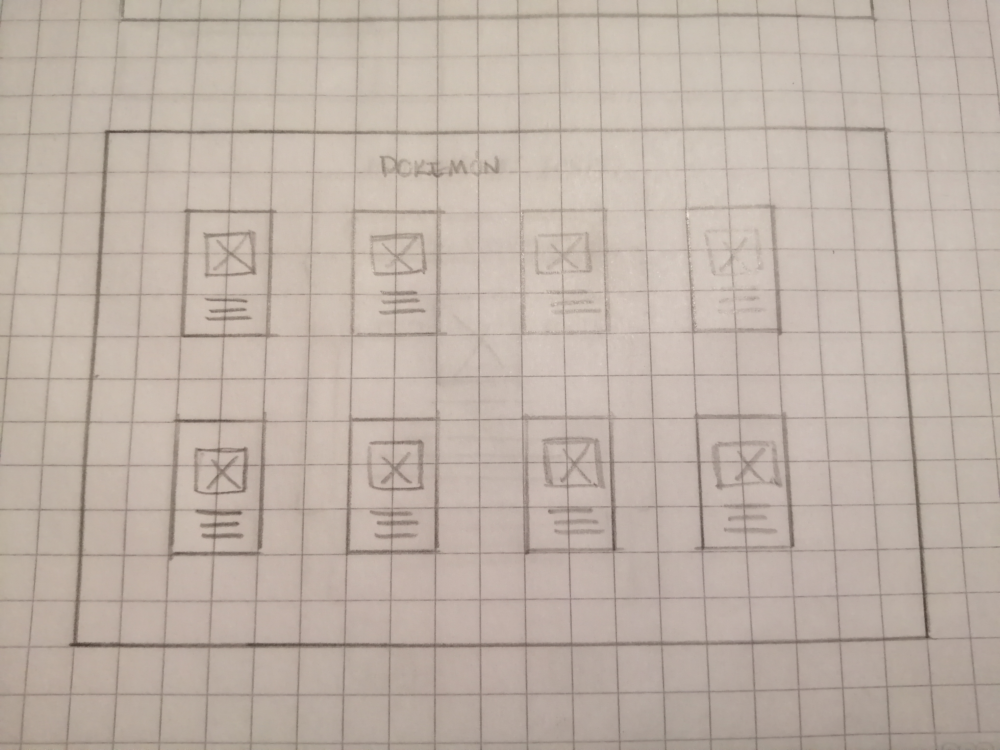
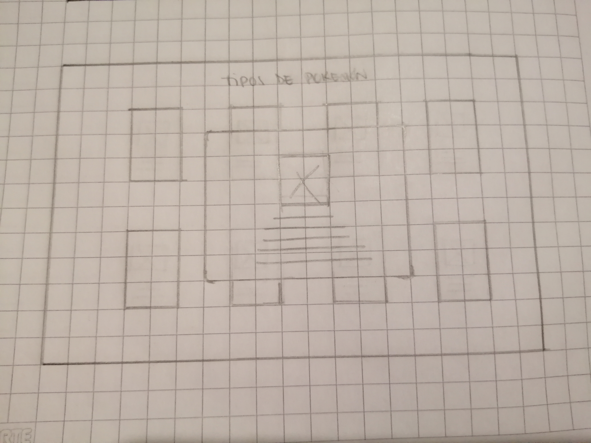
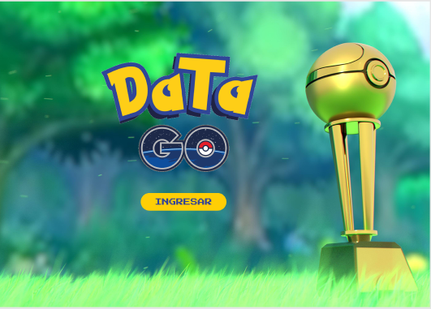
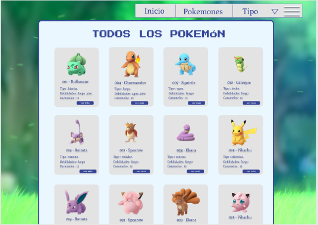
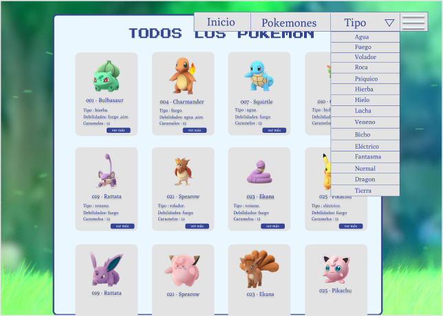
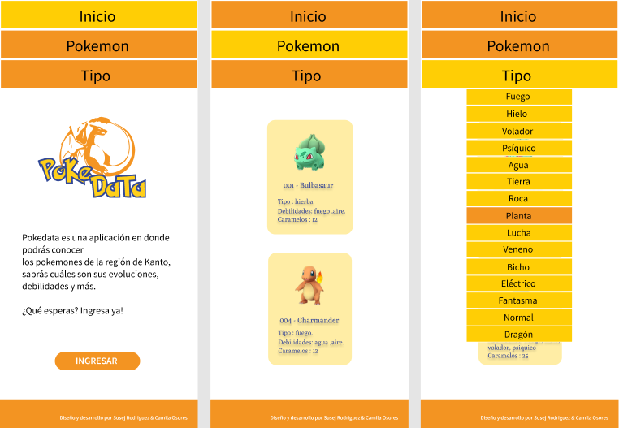

Pokedata es una aplicación donde podrás conocer los pokemón de la región de Kanto, descubrirás cuáles son sus evoluciones, debilidades y más.

# DEFINICION DEL PRODUCTO 🔎
Esta aplicación esta enfocada en usuarios novatos, que no tienen conocimiento sobre el juego Pokemón Go y quieren iniciarse como jugadores. Nuestro objetivo es hacer la adaptación del usuario al juego mucho más fácil y así hacer su experiencia única.

# OBJETIVO DE LOS USUARIOS 💻

- Conocer los Pokemones existentes en la región de Kanto.
- Conocer y poder clasificar los pokemones por tipos.

Este proyecto fue desarrollado basado en historias de usuarios, las cuales fueron planificadas en la herramienta TRELLO y pueden observar ingresando al siguiente link:

[Planificación en Trello](https://trello.com/b/5ffTeJcI/data-lovers)

# DESARROLLO DEL PRODUCTO 🚀

Para diseñar nuestro producto, comenzamos realizando sketchs a mano alzada y colocando las ideas que ambas teniamos con respecto al diseño de nuestra aplicación. Diseñamos un prototipo para dispositivo móvil y otro para web.

# Sketchs para dispositivo móvil:

# Sketchs para web:

Una vez realizados los sketchs comenzamos a hacer el prototipo de alta fidelidad utilizando la herramienta FIGMA, ahí comenzamos a darle forma a lo que ya habiamos hecho en papel, escogimos los colores, el logo y la imagen de fondo.

Link de testeo de usabilidad del primer prototipo
[Felipe Rodríguez](https://www.loom.com/share/9ee2c1f6eec049aca5624d91cb2e63dd)

Al realizado este prototipo comenzamos a darnos cuenta que no nos gustaba tanto el diseño y al ver el taller de UX sobre los Principios de Diseño Visual, nos dimos cuenta que podiamos hacerlo más apegado a esos tips que nos dieron ese día, por eso decidimos realizar un nuevo prototipo cambiando los colores, tipografías, fondo, entre otras cosas. 

# Prototipo de Alta fidelidad para dispositivo Móvil.

# Prototipo de Alta fidelidad para Web.
En el siguiente Link puede encontrar el prototipo de alta fidelidad con interacción.
[Prototipo de Alta fidelidad con interacción](https://www.figma.com/proto/JtPAE7bpiwhrdXGC6m95FP/PokeData?node-id=1%3A392&scaling=scale-down)

# TESTEO DE USABILIDAD 👨🏼‍💻

En el siguiente link pueden encontrar el testeo con usuario.

[Felipe Rodriguez](https://www.loom.com/share/494cb4e2a6964d85b5dd0b8e415b9665)

[Ignacio Moncada](https://www.loom.com/share/62181135dbe54d09bba2a5f443d15b42)

